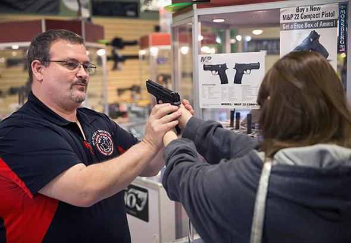
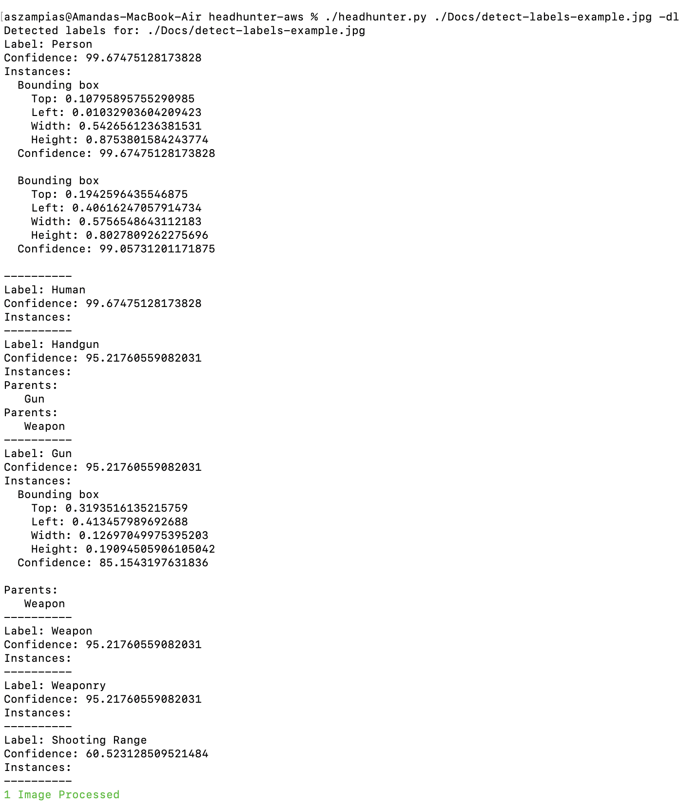
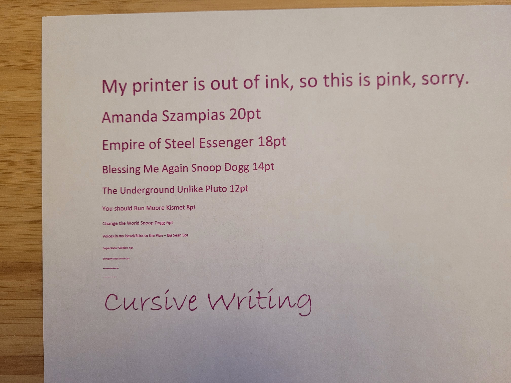
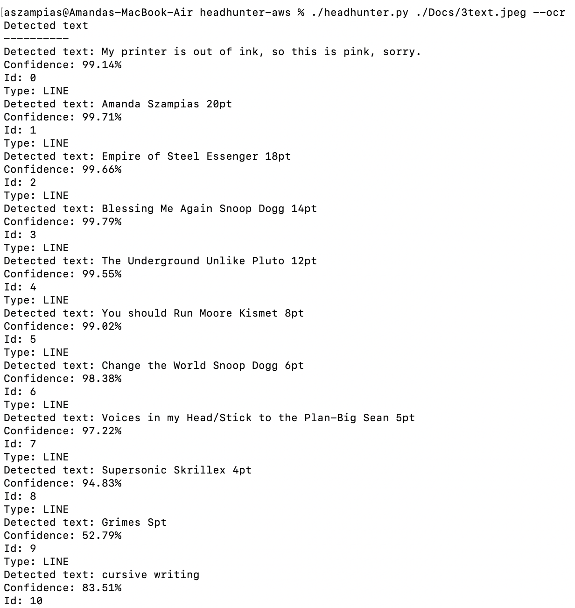

# headhunter-aws
Find people in face masks, sunglasses, low quality images, hats, and different hair styles using AWS Rekognition. HeadHunter takes an image (or sets of images) and identifies the same face in other photos. Options include People-To-Face, Person-To-Face, and Face-To-Face.

The program has a Detect-Labels and OCR feature too. Detect-Labels will find common objects like cars, drugs, alcohol, weed, injections, pills, guns, knifes, hammers, weapons, etc. OCR will take an image and parse text from it. 

## Steps
1. Install the python libraries using pip3:
<pre>
pip3 install -r requirements.txt
</pre>

2. Give permissions to the scripts for Linux:
<pre>
chmod +x create_collection.py
chmod +x headhunt.py
</pre>

3. Make a user using Amazon IAM Access. Obtain a User access_key_id and secret_access_key. Place both in your ~/.aws/credentials file.
Link: https://azure.microsoft.com/en-us/services/cognitive-services/face/

## Examples
I provided Face, Person, and People Examples using the singer-celebrity Grimes and Spaceman Elon. 
### Example 1: Person-To-Face
Description: Create a FaceIndex object using example images of Grimes in the KnownPeople/Grimes directory. I provided three photos of Grimes. 
<pre>
./create_collection.py grimes -t ./Known_People/Grimes
./headhunter.py grimes
</pre>

### Example 2: Face-To-Face
<pre>
./headhunter.py Grimes1.jpg -c ./Images
</pre>

### Example 3: People-To-Face
Description: Add a picture of Elon to the Grimes directory. Run the command again. Now the algorithm will look for Elon and Grimes in photos.
<pre>
 ./create_collection.py spaceship -t ./Known_People/Grimes
 ./headhunter.py spaceship
</pre>

### Example 4: Detect-Labels
Description: Find common objects like humans, animals, weapons, cars, and more. This feature is very basic and a sample of what detect-labels can do. 
<pre>
 ./headhunter.py ./Docs/detect-labels-example.jpg -dl
</pre>

<b>Input Below</b>

<kbd>
 
  
</kbd>

### Example 5: OCR Detect Text
Description: Find text within an image
<pre>
 ./headhunter.py ./Docs/detect-text-example.jpeg -ocr
</pre>

<b>Input Below</b>

<kbd>
  
  
</kbd>

## Operating Systems
This script is supported on Windows, Linux, and MacOS.

## How-To Video

## 🚨 🚓 Amazon Policy Towards Police and Law Enforcement: Positive 🚓 🚨

If you are in law enforcement, Amazon (at least June 2022) has a positive view regarding police using its FacialRekognition technology. Keep up to date as these companies can change their minds. 

https://docs.aws.amazon.com/rekognition/latest/dg/considerations-public-safety-use-cases.html 
https://aws.amazon.com/rekognition/the-facts-on-facial-recognition-with-artificial-intelligence/ 
https://aws.amazon.com/blogs/machine-learning/marinus-analytics-fights-human-trafficking-using-amazon-rekognition/ 
https://aws.amazon.com/stateandlocal/justice-and-public-safety/ 

